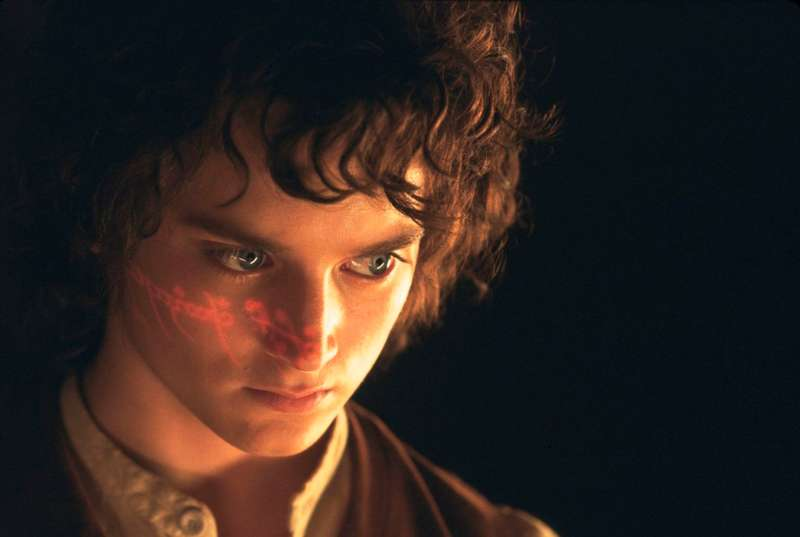
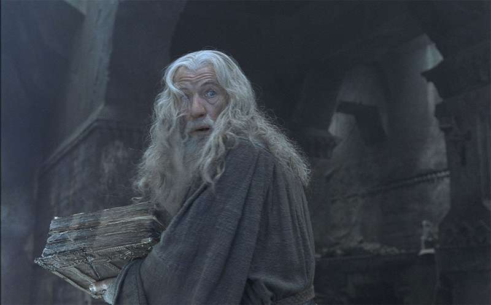

> Texto não autoral, retirado do site: https://www.estrelando.com.br/foto/2018/12/08/confira-12-curiosidades-sobre-a-trilogia-de-o-senhor-dos-aneis-212446/foto-3

## O Universo
'./frodo-face-ring.jpg'

O Senhor dos Anéis é uma das franquias mais bem-sucedidas da história do cinema. A história gira em torno de Frodo Baggins que, após se ver em propriedade de um poderoso anel que poderia destruir a humanidade, resolve destruir a joia, com a ajuda de alguns companheiros. Ao longo de A Sociedade do Anel, As Duas Torres e O Retorno do Rei acompanhamos esta jornada que conquistou diversos prêmios e arrecadou bilheterias impressionantes ao redor do mundo. Veja a seguir curiosidades sobre a franquia!

### Improviso é importante? Faz história?

- Também no primeiro filme, quando Gandalf chega à casa de Bilbo Baggins, ele sem querer bate a testa em um pedaço do teto. O momento não foi proposital e Ian McKellen continuou a cena, como se nada tivesse acontecido. O diretor, Peter Jackson, depois o elogiou, afirmando que o astro fez um ótimo trabalho atuando por meio do erro.

[frodo met the ring](https://en.wikipedia.org/wiki/Salted_duck_egg)