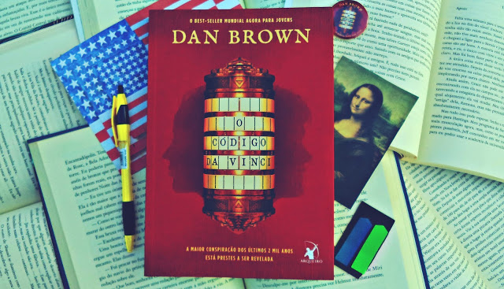
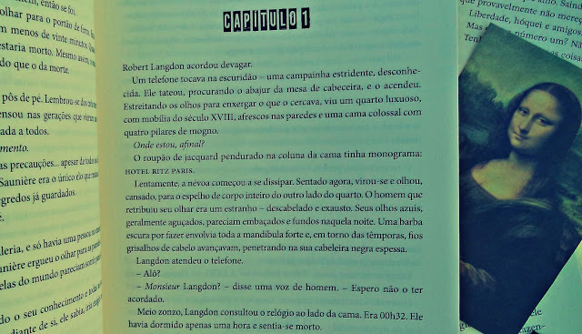
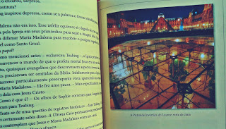

Dan Brown é o autor de suspense mais popular da atualidade, com mais de 150 milhões de livros vendidos. Seu mega-seller O Código Da Vinci já vendeu mais de 80 milhões de exemplares em todo o mundo. Ele também escreveu Anjos e Demônios, O Símbolo Perdido, Inferno, Fortaleza Digital e Ponto de Impacto. Dan é casado com a pintora e historiadora da arte Blythe, que colabora nas pesquisas de seus livros. Ele mora na Nova Inglaterra, nos Estados Unidos.

## O plot

Jacques Saunière, o renomado curador do Museu do Louvre, trabalhava tarde da noite quando Silas, um albino alto, de ombros largos, pele branca como a de um fantasma e cabelos também brancos e ralos, entrou na Grande Galeria do museu na intenção de fazer com que o velho de 76 anos lhe contasse o que tanto queria saber: o segredo antiquíssimo protegido pela fraternidade a qual Jacques faz parte. O curador então, com imenso cuidado, contou uma mentira que havia ensaiado várias vezes — um protocolo que ele e outros três guardiões deveriam realizar caso fossem encontrados.
  
Saunière só não contava que mesmo depois de “revelar o segredo” fosse ganhar um tiro no abdômen e que os outros três membros da fraternidade já estivessem mortos. O medo que o assaltava era bem maior do que o da morte. Ele precisava passar o segredo adiante — um dos maiores já guardados. Gemendo de dor, concentrou todo o seu conhecimento e todas as suas forças e desenhou um pentagrama em sua carne, escreveu algumas frases no piso do museu, deixou outras pistas ocultas pela cena do crime e deitou-se com as pernas e os braços bem abertos.
  
Robert Langdon, professor de Simbologia Religiosa da Universidade de Harvard, havia acabado de se deitar, cansado depois de uma palestra na Universidade Americana de Paris, quando a Polícia Judiciária Francesa o convocou para tentar entender o que aconteceu com Jacques, considerando seu conhecimento de simbologia e seus planos de se encontrar com o curador. Com a ajuda da criptógrafa Sophie Neveu, Langdon, acusado de matar Saunière, sai em busca de descobrir a maior conspiração dos últimos 2 mil anos e desvendar seus mistérios, enquanto pessoas tentam matá-lo e manter o segredo guardado a qualquer custo.

Nos dias atuais, é quase impossível conhecer alguém que nunca tenha ouvido falar em O Código da Vinci, sucesso que já vendeu mais de 80 milhões de exemplares, surpreendeu a grande maioria dos fãs de Brown e em 2006 foi adaptado para as telonas. Eu, claro, fazia parte da parcela que já tinha ouvido falar no livro, mas jamais tirou um tempo para lê-lo ou até mesmo saber do que se tratava. Fico incrédulo quando me recordo que deixei isso acontecer por tantos anos! Colocando os carros na frente dos bois, já adianto: foi uma das melhores leituras já realizadas. 
  
Eu não sabia exatamente o que esperar — já que, além de nunca ter assistido à adaptação de O Código da Vinci, eu também nunca havia lido nada de Brown —, mas confesso que qualquer expectativa que se tenha para este livro sempre há de ser superada. Eu sempre gostei de romances policiais e de suspenses, apesar de não ser um gênero lido com frequência. Quando fiquei sabendo que a Arqueiro iria lançar a versão jovem de O Código da Vinci — com mudanças apenas na linguagem! —, encontrei ali a minha oportunidade de conhecer a obra e, claro, esse grande autor, que, sim, é um dos melhores do gênero — se não for o melhor!

### Narração

A narração incrivelmente bem elaborada acontece em terceira pessoa, com um narrador que tudo sabe, tudo vê e que, de certa forma, acaba deixando muito de sua opinião transparecer na obra. A escrita de Brown é extremamente eletrizante, moderna nesta versão e mantem um ritmo dinâmico e fluido até o fim — eu li o livro em pouco mais de um dia. Também cabe ressaltar que a construção do suspense é aberta, nos permitindo compreender os mistérios e acompanhar como um participante essa verdadeira caça ao tesouro por países europeus.

Apesar da ocorrência de muitos fatos históricos e religiosos, tudo acontece com calma e com as cenas bem centralizadas nos dois protagonistas, Robert Langdon, professor de Simbologia Religiosa da Universidade de Harvard, com uma mente brilhante, e Sophie Neveu, criptógrafa da Polícia Judiciária Francesa, que agradará a maioria por sua personalidade aventureira e inteligente — não se deixem levar pela adaptação cinematográfica, já que o filme nem chegou perto de demonstrar quem realmente é Langdon e Neveu.

O que mais chama atenção em O Código da Vinci e que nos faz, figurativamente e não literalmente, devorar o livro é a capacidade incrível com que Dan mistura ficção e realidade, religião e ciência, polêmica e política, e nos faz pensar, alegando que, independente de acreditarmos ou não nos segredos que estamos prestes a descobrir, ele espera que essa jornada — a do livro — nos inspire a continuar em busca de nossa própria verdade, seja ela qual for. A narrativa polêmica apresenta fatos religiosos e históricos que, em grande parte, são interessantes por serem verídicos, como por exemplo o fato de O Priorado de Sião — sociedade secreta europeia fundada em 1099, presente no livro — realmente existir. Em 1975, a Biblioteca Nacional de Paris descobriu pergaminhos conhecidos como Os Dossiês Secretos, que identificavam inúmeros membros do Priorado, inclusive o cientista Isaac Newton e o artista e inventor Leonardo da Vinci. 

O Opus Dei, uma organização católica profundamente conservadora, que tem importância bastante salientada na obra, também é mostrada sendo um objeto de controvérsias devido a relatos de práticas extremas. Além das organizações secretas, todas as descrições de obras de arte, arquitetura, documentos e rituais secretos neste romance correspondem rigorosamente à realidade.

Não foi somente por ser bem escrito que O Código da Vinci vendeu mais de 80 milhões de exemplares. Como sabemos, é uma história bem polêmica, principalmente por tratar de religião e história de uma maneira bem peculiar. Eu, particularmente, não encontrei nada que me desagradasse na obra e, mesmo sendo cristão, não levei nada para o lado pessoal ou religioso. É preciso, acima de tudo, estar com a mente aberta para a leitura de tal obra. Na verdade, qualquer leitura necessita que nossa mente seja expandida e que possamos absorver as informações sem julgamentos, certo? Sendo os fatos verdade ou não, o livro ainda é uma ficção. 

Agora falemos da edição — e que edição, hein!? A Editora Arqueiro preparou uma edição fantástica, o esmero com que foi montada é perceptível só em olhar para a capa, que mostra o críptex — objeto de extrema importância para o desenvolvimento da obra — com as sombras de um casal, claramente Robert Langdon e Sophie Neveu. A diagramação, no todo, é simples e segue os padrões de sempre da editora. Essa nova edição, vale ressaltar, é especialmente para o público jovem, com mudanças apenas na linguagem, com um caderno de fotografias coloridas que enriquecem ainda mais o conteúdo, além de um Guia do Professor que acompanha separadamente a obra (que também pode ser acessado aqui), para a realização de estudos dirigidos e auxilio em clubes do livro. 

O Código da Vinci traz o que de melhor pode ter o gênero Suspense e, sem dúvidas, não fica devendo para nenhum outro. Se já era bom numa linguagem mais rebuscada, imaginem só numa versão jovem, com uma linguagem mais simples? Cheio de segredos, conspirações, traições, enigmas, sociedades secreta e revelações, este é um livro para ser lido por todos os amantes de literatura — especialmente os jovens, que agora têm a oportunidade de conhecer Dan Brown numa edição feita justamente para eles. Eu recomendo e só posso esperar que mais livros do autor sejam relançados com versões como esta!

> Nota: 4.5

> Texto não autoral, retirado do site: http://palaciodelivros.blogspot.com/2017/01/resenha-o-codigo-da-vinci-dan-brown.html